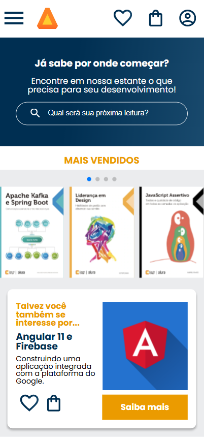
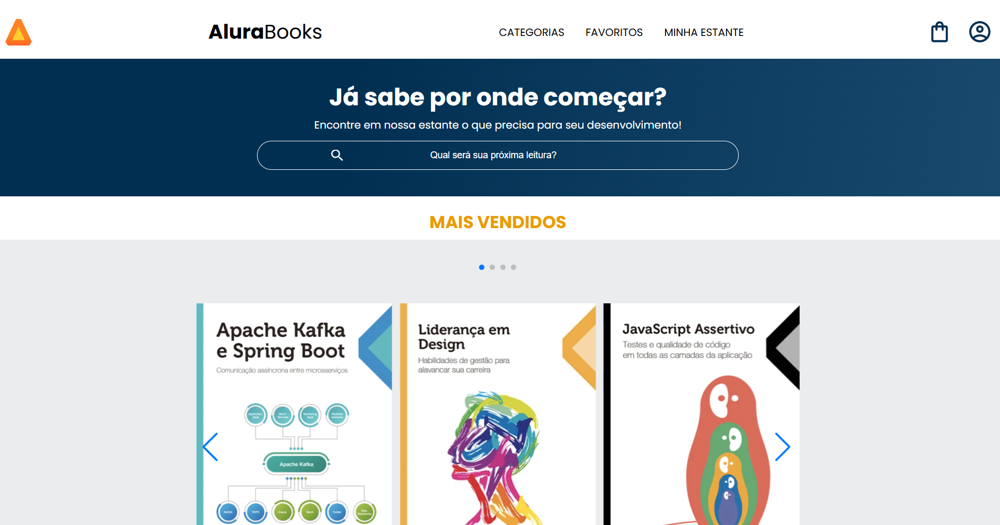
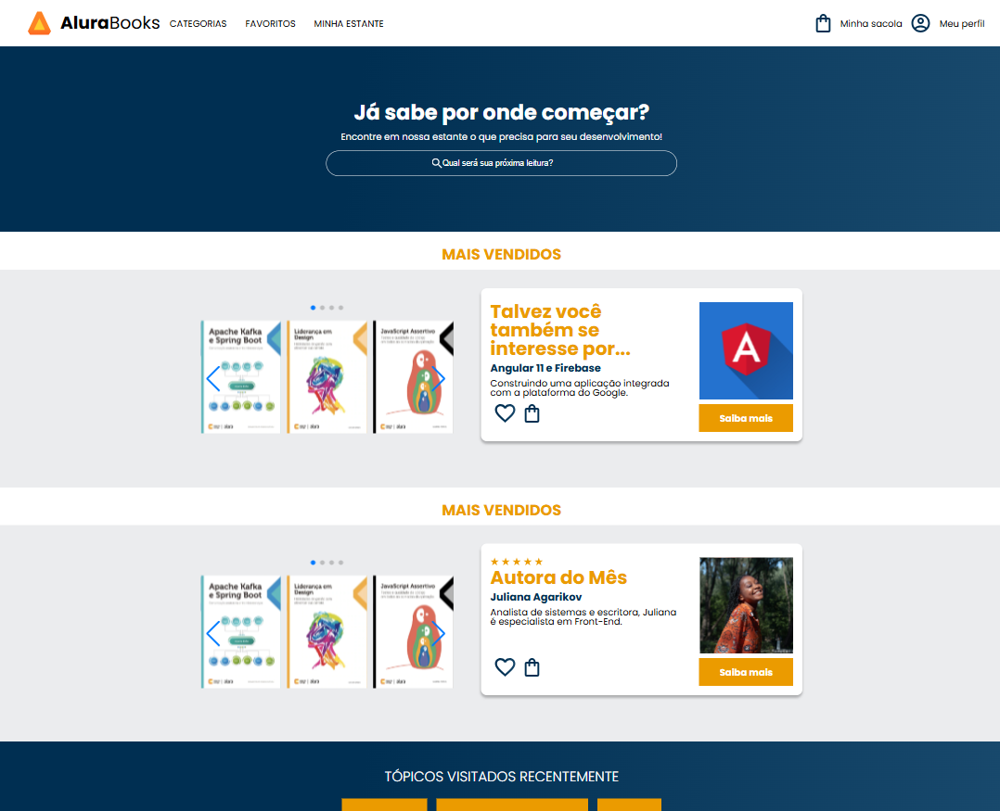

# Alurabooks

## ℹ️ Sobre

Projeto utilizado no curso para aprendizado das técnicas e melhores práticas.

## 📘Ementa

### HTML e CSS: responsividade com mobile-first

- Construir um site com HTML e CSS
- Entender como interpretar um protótipo de site criado no Figma
- Conhecer a abordagem mobile-first
- Aprender a utilizar media queries na construção de layouts responsivos
- Realizar o deploy de um site através do Github Pages
- Compartilhar seu aprendizado nas redes sociais

## 🖥️ Tecnologias

  
  

## 🧑‍🏫 Instrutor(es)

| [ Mônica Hillman](https://github.com/MonicaHillman) |
| :--------------------------------------------------------------------------------------------------------------------------------------------------------: |

## 💻 Screenshot

  
  
  

